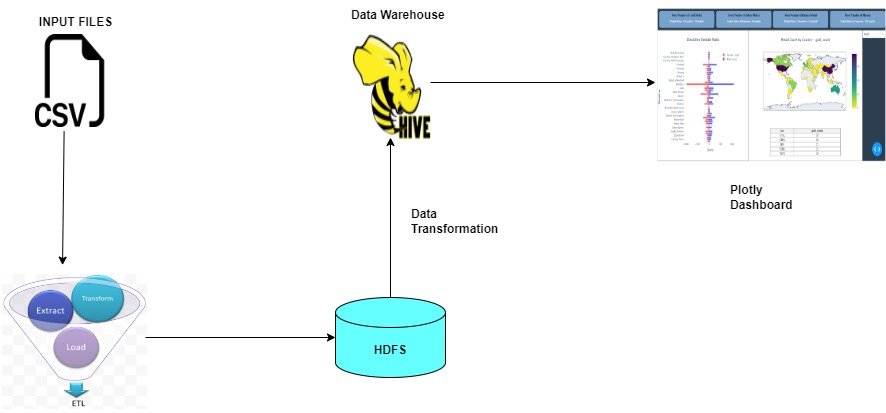
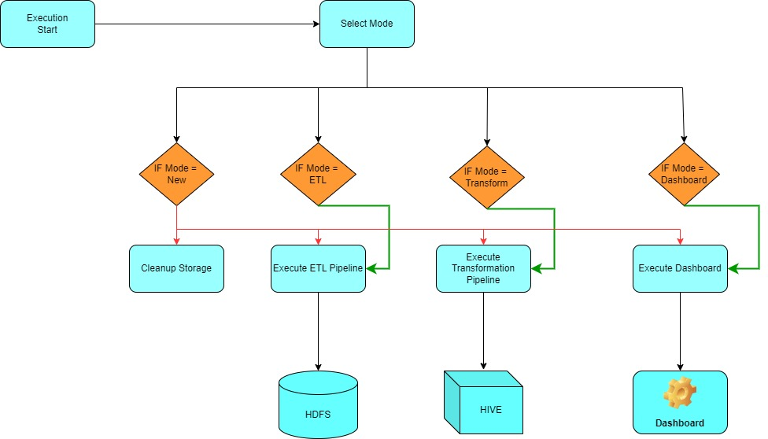

# Objective :

Create a Pyspark data pipeline with following steps:
1. Data Extraction : Extract the data from csv file.
2. Data Loading : Load the data into HDFS in CSV, Parquet and ORC format.
3. Data Transformation : Perform data transformation as per requirement.
4. Data Storage : Store the transformed data in a hive data warehouse.
5. Data Visualisation : Visualise the data using Python Plotly dashboad.

 

# Prerequisite:
Python

pyspark

dash

plotly

# STEPSWISE APPROACH :
 
1. Execution start by providing the mode:

    a. New : The program will run with a new state, first it will cleanup the hive datawarehouse then execute the ETL pipeline, Transformation pipeline and Dashboard pipeline sequentially.

    b. ETL : The program will only execute the ETL pipeline.

    c. Transform : The program will only execute the Data Transform pipeline.

    d. Dashboard : The programe executes and the Dashboard pipeline and run the dashboard.

# Execution :
Execute the Main file by following command from the root directory:
python -m Main.Main
